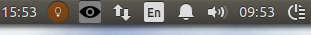

For a while now I have wanted a second clock on Ubuntu under Unity. I could not find a simple solution to do so. Specifically, I want to show UTC (or zulu time).

So `indicator-zulu` was created in a few minutes time this morning.

It shows `zulu` time. That is it. 

## Details

For now, there is no .deb package. One needs to add it to your startup applications.

`indicator-zulu` has only been tested on Python 2.7 (it does not work with Python 3 due to import name changes) and Ubuntu 14.04.

It depends on your clock to be set correctly and has a 100 millisecond delay for the update of the text.

## Other methods

I did find a way to show [arbitrary output of a shell command](http://www.webupd8.org/2014/05/ubuntu-appindicator-that-displays-bash.html). 

I also found an [indicator for many timezones](https://github.com/sfstpala/World-Clock-AppIndicator/blob/master/world-clock); however, I wanted a clock shown instead of needing to click the indicator. I can do the same with the built in clock.

If you would like to change the order, [you can](http://www.webupd8.org/2011/06/how-to-change-application-indicators.html).